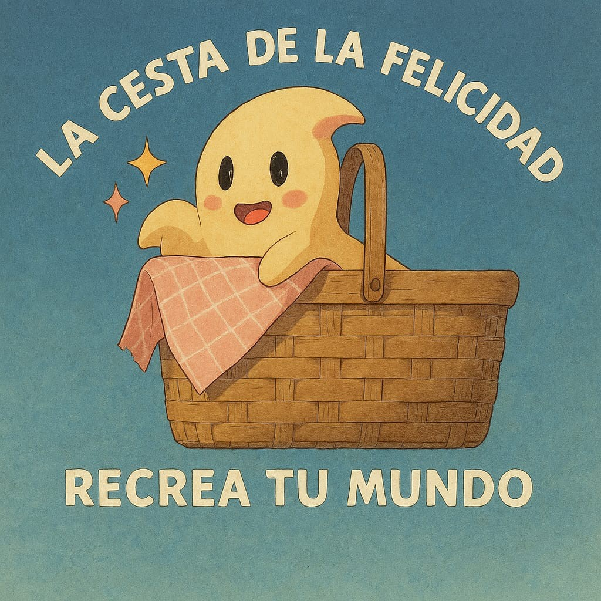

# La-cesta-de-la-Felicidad
Recrea tu Mundo
<!DOCTYPE html>
<html lang="es">
<head>
    <meta charset="UTF-8">
    <meta name="viewport" content="width=device-width, initial-scale=1.0">
    <title>La Cesta de la Felicidad</title>
    
</head>
<body>
    <h1>La Cesta de la Felicidad</h1>
    
Recrea tu mundo a través de la alegría, el juego y la creatividad. ¡Bienvenido a nuestro proyecto!

    
</body>
</html>
